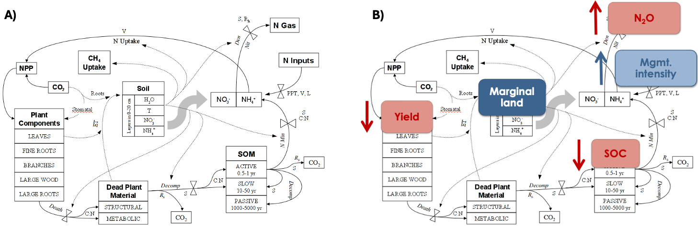
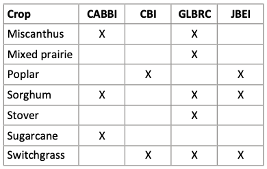

# Inter-BRC comparison of ecosystem & soil carbon modeling

This repository is for sharing agro-ecosystem and soil carbon model results and analysis code across the four DOE-funded Bioenergy Research Centers (BRC). It is meant to support the inter-BRC Shared Research Objective on Technoeconomic Analysis (TEA), Life-Cycle Assessment (LCA), and Land Use and agro-ecosystem modeling (formerly SRO9). This collaborative effort is initially focused on a comparison of carbon cycling modeling across the different centers, with an emphasis on soil carbon:

>**PY24 SRO Outcome**—Set up ensemble models/datasets to quantify biogenic carbon cycling and uncertainty for at least one bioenergy crop, drawing on marginal land datasets, soil carbon models, and downstream LCA frameworks across the BRCs.

This is currently set up as a public repository, geared towards sharing and comparison of previous-published datasets and codes. **Proprietary or sensitive information should not be shared here, as this space is accessible to people not bound by the BRC NDA.** In parallel to this data and code exchange, we are also exploring the importance of soil carbon in bioenergy life-cycle assessment and policy in a separate, Policy Forum-type collaborative manuscript entitled **"Can a field-first approach to transparent, performance-based monitoring of perennial crop ecosystem services help get the bioeconomy re-boot on the right path?"**:
https://docs.google.com/document/d/1oUqAqNoSDt-6QUJ1e4LPUxeTTTQJ5mGrCwmo7FiwuIw/edit  

This repository was originally established by John Field (FieldJL@ornl.gov) from the Center for Bioenergy Innovation (https://cbi.ornl.gov/). 

## Introduction

Process-based models are widely used to simulate the cycling of carbon, water, nitrogen, and other nutrients in managed and unmanaged ecosystems. They are widely used in bioenergy assessment, and also in carbon market monitoring, reporting & verification (MRV) protocols that attempt to quantify and valorize climate-smart agricultural practices that increase soil organic carbon (SOC) storage and decrease emissions of other agricultural greenhouse gases (GHG).
Such models are uniquely useful for: 
- Synthesizing, interpolating and extrapolating limited field observations.
- Full-GHG accounting, i.e., including soil carbon, nitrous oxide (N2O), and methane (CH4).
- Scenario analysis considering novel crops, management practices, landscape designs, and future novel climates.

Each of the BRCs includes a modeling effort using the process-based DayCent model: 
>Parton, W. J., Hartman, M., Ojima, D., and Schimel, D. (1998). DAYCENT and its land surface submodel: Description and testing. Global and Planetary Change 19, 35–48. http://www.sciencedirect.com/science/article/pii/S092181819800040X

This provides a basic point of comparison across the projects. 

*A) Schematic of the DayCent model. B) Conceptual illustration of an integrated assessment, in which targeting biomass crop cultivation on marginal lands might require more intensive management, which in turn affects crop yields, SOC outcomes, and N2O emissions.*

## Scope of comparison 

### Crops
Each of the BRCs specializes in developing and assessing a different set of dedicated biomass crops, as shown in the matrix below. 

*Matrix showing the dedicated biomass crops modeled across each of the 4 BRCs.*

### County-scale comparisons
Easy scale to work at for data exchange and visualization.
Supports research questions such as:
- Do different models/modeling groups show consistent regional patterns in yields and SOC outcomes?
- Are energy crop yield outcomes consistent (in aggregate) with field trials and synthesis datasets such as the PRISM-EM data underlying the DOE Billion-Ton studies (https://bioenergykdf.net/farmgate)?
- Are convention crop yield outcomes (utilized in model spin-up and/or counterfactual cases) consistent with NASS statistics?
- Are models responsive to lower productivity-regions with more challenging climates?

### Field or sub-field-scale comparisons
More challenging in terms of larger datasets and customized data formats and analysis workflows. However, comparisons at this scale support more nuanced comparisons addressing research questions such as:
- Can these models reproduce lower observed conventional crop yields on marginal land? (e.g., based on remotely-sensed data generated by the BASSO lab and elsewhere)?
- How do different models and different scenario lead to different SOC sequestration outcomes on marginal lands specifically? Bigger or smaller per-hectare sequestration potential compared to prime land?

### Simulation meta-data
As we expand the data-sharing and model intercomparison effort, it will become important to track meta-data across the different datasets, potentially including:
- What crop(s) are you modeling, with what models?
- What calibration/validation data sources did you use? Are they publicly available/shareable? Targeted toward marginal land? What calibration/validation methods (by hand, param. optimization, etc.)?
- Are there any specific plant varieties/traits/behaviors you are trying to capture?
- What types of land-use transitions were modeled? For example, are the simulations targeted/restricted to marginal or abandoned land? Or do they reflect land use choices specified in a coupled economic model?
- What model outputs have you tracked/analyzed? Yield? SOC & other GHGs (esp.N2O)? Water use, quality? Spatial or inter-annual variability? Any explicit analysis of yield & SOC outcomes vs. land quality?
- What's the publication status of the analysis, and underlying datasets and code?

## Content

**CBI**—We have contributed an initial set of DayCent switchgrass modeling results which were recently published as part of a broader TEA & LCA modeling paper:
>Smith, J. P., Limb, B. J., Beal, C. M., Banta, K. R., Field, J. L., Simske, S. J., and Quinn, J. C. (2023). Evaluating the sustainability of the 2017 US biofuel industry with an integrated techno-economic analysis and life cycle assessment. Journal of Cleaner Production, 137364. https://doi.org/10.1016/j.jclepro.2023.137364 

Associated tabular data is forthcoming.
The code notebook **DayCent_regional_postprocess-farm-level-ABM2.ipynb** includes visualization of these model results, and also comparison to some preliminary Miscanthus model results generated by Dr. Jeff Kent, formerly of CABBI. 
We have also conducted sensitivity analyses to explore how changes in plant traits (e.g., productivity potential, belowground partitioning fraction, nitrogen use efficiency, etc.) might affect yield and GHG outcomes at national scales. These comparisons will be added to this repository soon. 

**CABBI**—abc

**GLBRC**—abc

**JBEI**—abc

## Additional Resources

GLBRC maintains an interactive web map of various land types that might support future bioenergy cropping: https://atlas.glbrc.org/

2023 Billion-Ton Report Update (BT23) Data Portal: https://bioenergykdf.net/bt23-data-portal

Select relevant BRC papers:
- Gautam, S., Mishra, U., Scown, C. D., and Zhang, Y. (2020). Sorghum biomass production in the continental United States and its potential impacts on soil organic carbon and nitrous oxide emissions. GCB Bioenergy 12, 878–890. https://doi.org/10.1111/gcbb.12736
